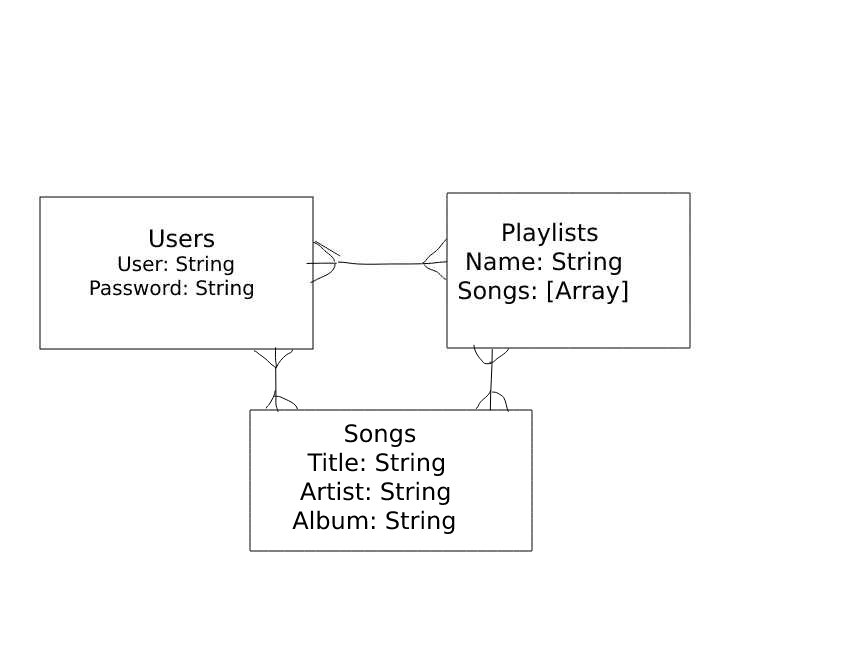

## USER STORIES
As a user I want to:
- Sign In
- Sign Up
- Sign Out
- Change Password
- Search for a playlist
- Save playlists to my playlists
- Listen to music continuously while searching for playlists
  
## TECH USED
- Axios
- Bootstrap CSS
- Express
- Node
- React
- MongoDB
- Mongoose
- Spotify API

## USER ROUTES

| Verb   | URI Pattern            | Controller#Action |
|--------|------------------------|-------------------|
| POST   | `/sign-up`             | `users#signup`    |
| POST   | `/sign-in`             | `users#signin`    |
| PATCH  | `/change-password/`    | `users#changepw`  |
| DELETE | `/sign-out/`           | `users#signout`   |

## PLAYLIST ROUTES

| Verb    | URI Pattern           | Controller#Action      |
|---------|-----------------------|------------------------|
| GET     | `/play`               | `index page`           |
| GET     | `/play/:id`           | `show page`            |
| POST    | `/play`               | `create route`         |
| PATCH   | `/play/:id`           | `update route`         |
| DELETE  | `/play/:id`           | `delete route`         |

## WIREFRAMES

